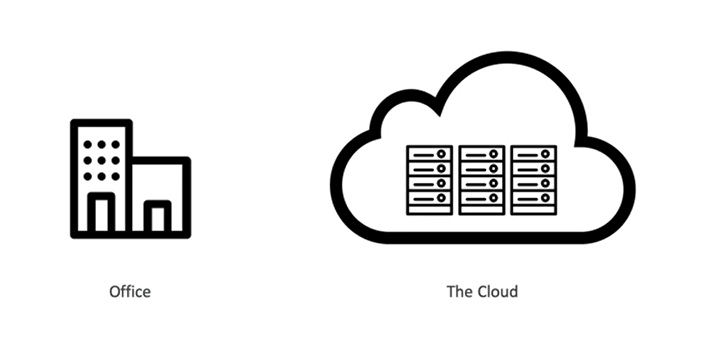

# Cloud practitioner

## What is cloud computing?

### Traditional IT Overview

The traditional way that the webservers works: 
- Client - Network - Server
- IP address
- Servers has
    - Compute: CPU
    - Memory: RAM
    - Storage: Data
    - Database: Store data in a structured way
    - Network: Routers, switch, DNS server. 

### Cloud computing

Key facts about cloud computing:
- On-demand delivery
- pay-as-you-go pricing
- provision exactly the right type and size of computing resources 
- you can access all the resources in seconds
- simple way to access servers, storage, databases and a set of application services
- Amazon Web Services owns and mantains the network-connected hardware

The deployment models of the cloud:
- Private Cloud (rackspace)
- Public Cloud (Azure, Google Cloud Platform, Amazon Web Service)
- Hybrid cloud (private cloud and public cloud)

Five characeristics of Cloud Computing:
- On-deman self service
- Broad network access
- Multi-tenancy and resorce pooling
- Rapid elasticity and scalability
- Measured services

Six Advantages of Cloud Computing
- Trade capital expense for operational expense
- Benefit from massive economies of scale
- Stop guessing capacity
- Increase speed and agility
- Stop spending money running and maintaining data centers
- Go global in minutes

Problems solved by the cloud:
- Flexibility
- Cost-effectiveness
- Scalability
- Elasticity
- High-availability
- Agility

### Three types of cloud computing

Types of cloud computing:
- Infrastructure as a Service (IaaS) - EC2
- Platform as a Service (PaaS) - Elastic Beanstalk, Heroku
- Software as a Service (SaaS) - Rekognition, Zoom

Pricing of the cloud:
- Compute (Pay for compute time) (Lambda, EC2)
- Storage (Pay for data stored in the Cloud) (S3)
- Data transfer OUT of the cloud

## IAM - Identity and Access Management

## EC2 - Elastic Cloud Computer

## EC2 Instance Storage

## ELB & ASG - Elastic Load Balancer and Auto Scaling Groups

## Amazon S3 - Amazon Simple Storage Service 