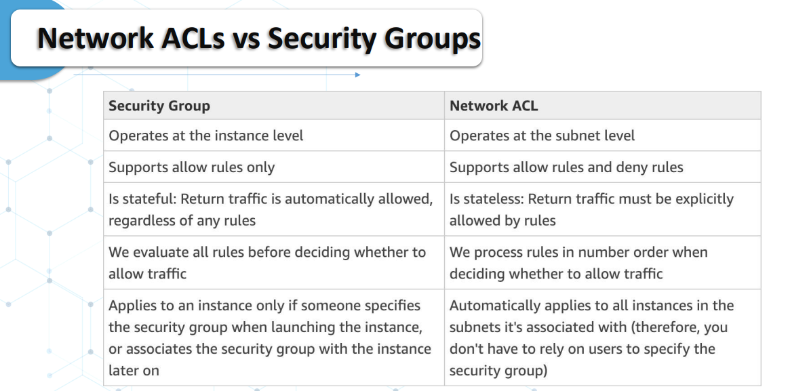
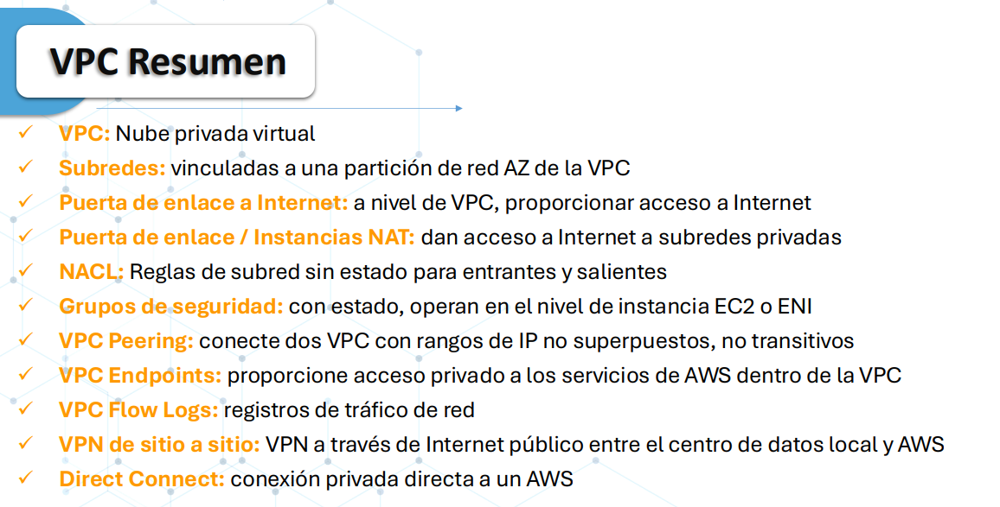

# Networking and Content Delivery

## Amazon VPC

* VPC: Virtual Private Cloud
* Subredes por zona de disponibilidad:
    * Públicas
    * Privadas
    * Hasta 200 subredes por VPC
* CIDR: Classless Interdomain Routing
* Tablas de enrutamiento:
    * Cada subred tiene una tabla de enrutamiento
    * Se pueden asociar con múltiples subredes
    * Puedes tener 50 rutas por tabla de rutas
* Enrutamiento:
    * Internet Gateway (Subredes públicas):
        * Ayudan a que la instancia de EC2 se pueda comunicar al exterior
    * NAT Gateway (Networking Address Translate):
        * Permiten que las instancias de las subredes privadas accedan a Internet sin dejar de ser privadas
    * VPN Gateway:
    * AWS Transit Gateway
    * AWS Direct Connect
    * Peering Connect
* Dirección IPv4 elástica es una dirección estática

## Security

* NACL (Network Access Control):
    * No tiene estado
    * Allow and Deny 
    * Se adjuntan en el nivel de subred
    * Las reglas sólo incluyen direcciones IP
* Security Groups:
    * Sí tiene estado
    * Sólo puede tener reglas ALLOW
    * Las reglas incluyen direcciones IP y otros grupos de seguridad

* VPC Flow Logs:
    * Captura información sobre el tráfico IP que ingresa a sus interfaces:
        * Registro de flujo de VPC
        * Registro de flujo de subred
        * Registro de flujo de la interfaz de red elástica

## Opciones de conectividad

* VPC Peering
    * CIDR no deben estar superpuestos
    * Se debe establecer cada conexión entre VPC (No transitivo)
* AWS Transit Gateway:
    * Permite conectar varias VPC centralizando la conexión
* VPC Endpoint:
    * VPC Endpoint Gateway:
        * S3 and DynamoDB
    * VPC Endpoint Interface (ENI):
        * Resto de servicio
        * Sólo se usa dentro de su VPC

## On-premises

* VPN:
    * Using Public Internet
* Direct Connect:
    * Conexión física entre instalaciones
    * Conexión privada
    * Al menos de un mes
* AWS Private Link:
    * Igual que los VPC Endpoints, sólo que se escala a miles de VPC

## Route53

* It works with DNS
* Registrador de dominio: Amazon Route53, GoDaddy
* Registros DNS: A, AAAA, CNAME, NS, ...
* Zone File: Contiene registros DNS
* Name Server: resuelve consultas DNS
* Dominio de nivel superior (TLD): .com, .us
* Dominio de segundo nivel (SLD): amazon.com, google.com
* DNS Autoritativo: Podemos actualizar los DNS
* Registros:
    * A: Host IPv4
    * AAAA: Host IPv4
    * CNAME: Asigna un nombre de Host a otro nombre de Host
    * DNS: servidores de nombres para la zona alojada
* Zonas alojadas:
    * Pública: Cómo se enruta el tráfico en internet
    * Privada: cómo se enruta el tráfico dentro de una VPC
* Políticas de routeo:
    * Simple: No health checks (the common case)
    * Weighted routing policy: Política de reglas ponderadas:
        * Asignar destinos con base en pesos
    * Latency Routing Policy:
        * The closest instance is going to receive the near user
    * Failover routing policy:
        * Primary instance
        * Failover instance

## Cloudfront

* It works with Edge Locations
* Orígenes:
    * Bucket S3:
        * Distribuir archivos
        * Cargar archivos
    * Orígenes Personalizados HTTP:
        * Balanceador de carga de aplicaciones
        * Instancias EC2
        * Sitio web S3
        * Cualquier backend HTTP que desees
* S3 Transfer Acceleration:
    * Aumenta la velocidad de transferencia entre puntos de ubicación